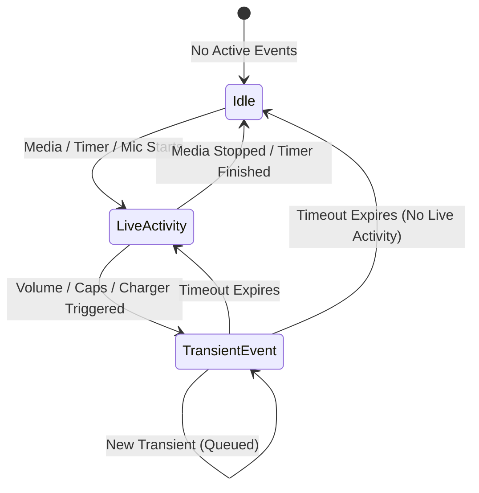

# Win11 Dynamic Island: Architecture & System Design

This document describes the architectural layout, rendering pipeline, animation model, event priority hierarchy, and service integrations for the **Win11-Dynamic-Island** mod.

---

## 1. High-Level Architecture Overview

```
+------------------------------------------------------------------------+
|                         Windhawk Mod Engine                            |
|        (Wh_ModInit, Wh_ModUninit, Wh_ModSettingsChanged hooks)         |
+------------------------------------+-----------------------------------+
                                     |
                                     v
+------------------------------------------------------------------------+
|                            Main Coordinator                            |
|             (Manages lifecycle, timer ticks, settings sync)            |
+--------------------+-----------------------------------+---------------+
                     |                                   |
                     v                                   v
    +----------------------------------+   +-----------------------------+
    |         Service Manager          |   |      Island Window          |
    |  - Priority Queue                |   |  - Layered HWND (WS_POPUP)  |
    |  - Transient HUD Dispatcher      |   |  - Direct2D Render Target   |
    |  - Live Activity State Resolver  |   |  - Mouse / Hover Tracker    |
    +----------------+-----------------+   +--------------+--------------+
                     |                                    |
     +---------------+---------------+                    v
     |                               |           +-----------------------+
     v                               v           |  Layout Engine        |
+--------------------+     +------------------+  |  - Taskbar info & DPI |
|   Live Activities  |     |  Transient HUDs  |  |  - Top embed vs float |
|  - Media (GSMTC)   |     |  - Volume (MMDev)|  |  - Compact vs Expanded|
|  - Focus Timer     |     |  - Caps Lock     |  +--------------+--------+
|  - Microphone      |     |  - Power/Battery |                 |
+--------------------+     |  - Bluetooth     |                 v
                           +------------------+  +----------------------------+
                                                 |      Animation Engine      |
                                                 |  - Spring Physics          |
                                                 |  - Cubic-Bezier Evaluator  |
                                                 +----------------------------+
```

---

## 2. Window & Direct2D Rendering Pipeline

### 2.1 Window Topology
The Dynamic Island UI is hosted within a top-level transparent popup window:
- **Window Styles**: `WS_POPUP` with extended styles `WS_EX_LAYERED | WS_EX_TOPMOST | WS_EX_TOOLWINDOW`.
- **Transparency & Anti-Aliasing**: Direct2D per-pixel alpha composition via `ID2D1DCRenderTarget` backed by a 32-bit ARGB DIB section, presented atomically to the DWM compositor via `UpdateLayeredWindow` with `ULW_ALPHA` (`AC_SRC_ALPHA`). Renders smooth sub-pixel antialiased squircle capsules without opaque black overlays, 1-bit GDI `SetWindowRgn` staircase artifacts, composition stalls, or colorkey fringing.
- **Hit-Testing & Controls**:
  - Non-blocking `WM_NCHITTEST`: Tests cursor against mathematical squircle geometry, returning `HTCLIENT` inside the island and `HTTRANSPARENT` in the transparent margins to pass mouse input seamlessly to background windows/taskbars.
  - State machine: `WM_LBUTTONDOWN` / `WM_LBUTTONUP` with `SetCapture` / `ReleaseCapture` and DPI-scaled button boundaries.
  - Compact state: Click expands the island into full activity mode.
  - Expanded state:
    - Media Controls: Previous, Play/Pause, and Next buttons with DPI-aware hitboxes.
    - Timer Controls: Pause/Resume (`Jeda`/`Lanjut`) and Stop buttons.
    - Content body click: Keeps island open and resets auto-collapse timer without premature dismissal.
  - Right-Click: Cycles through all 9 live and transient scenarios for rapid testing and visual verification.
  - Global Hotkeys: <kbd>Ctrl</kbd> + <kbd>Win</kbd> + <kbd>1..9, 0</kbd> simulates Media, Timer, Mic, Volume, CapsLock, Power, Bluetooth, Low Battery, Timer Done, and scenario cycling.
  - Hover Tracking: Pauses the 5-second auto-collapse timer while hovered.

### 2.2 Direct2D / DirectWrite Rendering
- **Factory Creation**: Single-threaded `ID2D1Factory` and shared `IDWriteFactory`.
- **Text Trimming & Word Wrapping**: Formats configured with `DWRITE_WORD_WRAPPING_NO_WRAP` and character ellipsis trimming, plus smooth horizontal text marquee (`DrawMarqueeText`) for overflowing media titles.
- **Render Target**: `ID2D1DCRenderTarget` with `DXGI_FORMAT_B8G8R8A8_UNORM` and `D2D1_ALPHA_MODE_PREMULTIPLIED` for clean subpixel text and geometry rendering.
- **Draw Call Cycle**:
  1. `BeginDraw()` (Binds 32-bit DIB section memory DC)
  2. `Clear(D2D1::ColorF(0, 0, 0, 0))` (Clear transparent surface)
  3. `DrawRoundedPill()` (Pure pitch-black `#000000` squircle capsule with zero outline stroke)
  4. Context-sensitive elements:
     - Digital clock (`HH:mm`) in idle compact state
     - Equalizer bars / Waveform (`DrawEqualizerWaves`) with WASAPI loopback RMS reactivity
     - Marquee song title & artist (`DrawMarqueeText`)
     - Radial progress ring (`DrawProgressRing`)
     - Battery / Volume progress slider (`DrawProgressBar`)
     - Privacy status dot (`DrawStatusDot`)
     - Text labels via DirectWrite (`Segoe UI Variable`)
  5. `EndDraw()`
  6. `PresentLayeredWindow()` (`UpdateLayeredWindow` with `ULW_ALPHA`)

---

## 3. Animation Engine: Spring Physics & Easing

Fluid spring transitions are defined by the cubic-bezier easing curve:
```css
--spring: cubic-bezier(0.34, 1.3, 0.5, 1);
```

### Numerical Evaluation
`Graphics::EvaluateCubicBezier` implements Newton-Raphson approximation to invert the cubic curve $X(t) = target_x$ in 8 iterations, solving for $t$, and evaluating $Y(t)$. This gives authentic native responsiveness matching modern fluid interfaces:
- Overshoot on expansion for an organic, bouncy feel.
- High initial velocity that decelerates smoothly into the target geometry.
- Independent animated properties for `Width`, `Height`, `CornerRadius`, and `Opacity`.

---

## 4. Dual Placement & Taskbar Integration

The Dynamic Island intelligently determines its position based on the Windows 11 taskbar configuration:

| Taskbar Edge | Placement Behavior | Expansion Direction |
|---|---|---|
| **Top** | Embedded directly into taskbar bar height, unified background | Expands **downwards** away from taskbar |
| **Bottom** | Floats 10px above the taskbar at horizontal center | Expands **upwards** into the screen |
| **Left** | Floats centered along the work area width | Expands **upwards** |
| **Right** | Floats centered along the work area width | Expands **upwards** |

When Windows taskbar Auto-Hide is enabled (`ABS_AUTOHIDE`), the island detects the tray's hidden/visible transitions and repositions itself near the monitor edge to avoid floating over fullscreen or border-adjacent windows.

---

## 5. Event Hierarchy & Priority Resolver

Events are divided into two distinct classes:

### 5.1 Persistent Live Activities
Longer-running background states that remain visible until closed or stopped:
1. **Microphone Active** *(Highest Live Priority)*: Privacy dot indicator.
2. **Focus Timer** *(Medium Live Priority)*: Active countdown session.
3. **Media Playback** *(Base Live Priority)*: Now Playing song details.

### 5.2 Transient HUD Events
Brief, high-priority notifications that temporarily take over the island pill and automatically restore the underlying live activity after their duration expires:
- `Volume`: 1800ms
- `CapsLock`: 1500ms
- `Power / Charging`: 2400ms
- `Bluetooth`: 2600ms
- `Low Battery`: 2800ms
- `Timer Finished`: 3200ms



---

## 6. Modular Compilation Architecture

Because Windhawk expects a single monolithic compilation unit (`.wh.cpp`), we use a build tool (`scripts/bundle.py`) to maintain clean modularity:

1. **`src/metadata/`**: Encapsulates Windhawk-specific comment headers and YAML settings schemas.
2. **`src/common/`**: Contains core types, DPI math, and logging abstractions.
3. **`src/platform/`**: Abstracts Windows shell APIs (`SHAppBarMessage`, monitor info).
4. **`src/graphics/`**: Encapsulates Direct2D, DirectWrite, and physics math.
5. **`src/overlay/`**: Windowing and layout calculations.
6. **`src/services/`**: Independent background monitors (Media, Audio, Battery, Keyboard, Bluetooth).
7. **`scripts/bundle.py`**: Reads `src/main.cpp`, recursively inlines internal `#include` trees, de-duplicates system `#include <...>` headers to the top, and emits `win11-dynamic-island.wh.cpp`.

This allows standard C++ modern modular practices during development while retaining 100% compatibility with Windhawk's single-file distribution model.

### 6.1 Windhawk Compiler & Linker Protocol
- **Complete Compiler & Linker Guide**: See [docs/COMPILER_GUIDE.md](docs/COMPILER_GUIDE.md) for full pitfall catalog, WinRT iteration rules, and linker architecture.
- **Linker Libraries (`@compilerOptions`)**: Mod metadata in `src/metadata/mod_header.h` must declare all 15 required import libraries:
  `-ld2d1 -ldwrite -lwindowscodecs -luxtheme -lole32 -loleaut32 -lruntimeobject -lwindowsapp -lshcore -lversion -lgdi32 -ldwmapi -luser32 -lshell32 -ladvapi32`.
  Specifying `@compilerOptions` overrides default linker libraries; omitting `-luser32`, `-lshell32`, `-ladvapi32`, `-loleaut32`, `-lruntimeobject`, or `-ldwmapi` causes undefined symbol errors in `ld.lld`.
- **Automated Verification**: Always verify builds using `python scripts/verify.py` (or `npm run verify`), which compiles the bundle for both `x86_64` and `i686` targets using Windhawk's native Clang toolchain before deployment.
- **Windhawk API Fallback Guard (`WH_MOD`)**: The Windhawk engine pre-includes `windhawk_api.h` and defines `WH_MOD`. All mock/fallback declarations in `src/common/defs.h` (`Wh_Log`, `Wh_Get*Setting`) must be strictly guarded with `#ifndef WH_MOD` to prevent language linkage conflicts and redefinition errors.
- **C++/WinRT Collection Traversal**: Never use range-based for loops over `IVectorView<T>` or `IVector<T>` due to Clang template deduction limitations on `begin()`. Use index-based traversal (`Size()` / `GetAt(i)`).
- **Inline Variables**: Global constants in headers (colors, SVG icon paths) must use `inline constexpr` to prevent Clang `-Wunused-const-variable` warnings across compilation units.

